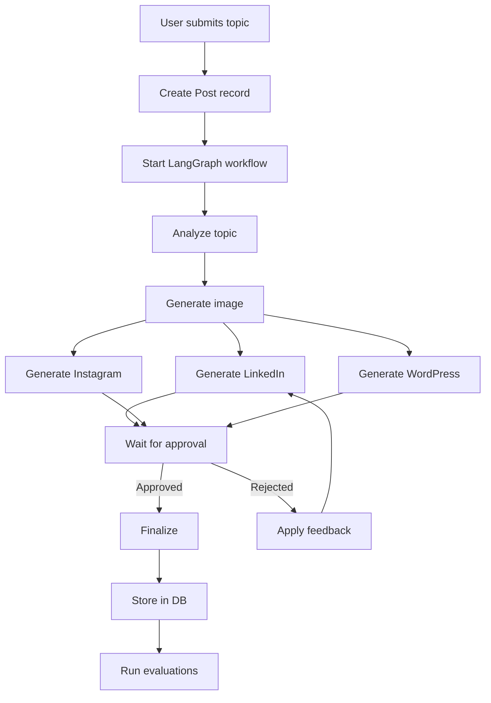

# Architecture Documentation

## System Overview

The Social Media Post Generation Agent is a multi-platform content generation system built with LangGraph, FastAPI, and PostgreSQL. It uses an agentic workflow with human-in-the-loop review to generate optimized content for LinkedIn, Instagram, and WordPress.

## Architectural Decisions

### 1. Repository Pattern

**Decision**: Use the Repository pattern instead of simple CRUD functions.

**Rationale**:
- **Encapsulation**: Each repository encapsulates all database operations for a single model
- **Testability**: Easy to mock repositories for testing
- **Maintainability**: Changes to database logic are isolated to repository classes
- **Single Responsibility**: Each repository has one clear purpose

**Implementation**:
```python
# repositories.py
class PostRepository:
    def __init__(self, db: Session):
        self.db = db
    
    def create(self, topic: str) -> Post:
        # Create logic
    
    def get_by_id(self, post_id: int) -> Optional[Post]:
        # Retrieval logic
```

**Benefits**:
- Clear separation between business logic and data access
- Easy to add caching or other cross-cutting concerns
- Better than scattered CRUD functions

### 2. Pydantic Models for State

**Decision**: Use Pydantic models instead of TypedDict for LangGraph state.

**Rationale**:
- **Validation**: Automatic data validation on state updates
- **Type Safety**: Better IDE support and type checking
- **Serialization**: Built-in JSON serialization/deserialization
- **Documentation**: Self-documenting with Field descriptions

**Implementation**:
```python
# state.py
class PostGenerationState(BaseModel):
    topic: str
    post_id: int
    image: Optional[ImageData] = None
    linkedin_post: Optional[LinkedInPost] = None
    # ... more fields
```

**Benefits**:
- Catches errors at runtime with validation
- Cleaner than dictionaries
- Works seamlessly with FastAPI

### 3. Platform-Specific Content Schemas

**Decision**: Create dedicated Pydantic models for each platform's content structure.

**Rationale**:
- **Type Safety**: Each platform has different requirements
- **Validation**: Enforce character limits, hashtag counts, etc.
- **Clarity**: Clear structure for what each platform needs
- **Extensibility**: Easy to add platform-specific features

**Implementation**:

#### LinkedIn Post
```python
class LinkedInPost(BaseModel):
    text: str = Field(..., max_length=3000)
    image: Optional[ImageData] = None
    hashtags: List[str] = Field(default_factory=list, max_items=5)
```
- Professional tone
- Max 3000 characters
- Image at top
- Limited hashtags

#### Instagram Post
```python
class InstagramPost(BaseModel):
    caption: str = Field(..., max_length=2200)
    image: ImageData  # Required!
    hashtags: List[str] = Field(min_items=10, max_items=30)
```
- Visual-first (image required)
- Caption with character limit
- Many hashtags (10-30)

#### WordPress Post
```python
class WordPressPost(BaseModel):
    title: str
    excerpt: str
    sections: List[WordPressSection]
    featured_image: Optional[ImageData] = None
    seo_description: str
```
- Structured content (sections)
- Images can be placed anywhere in the article
- SEO metadata

### 4. WordPress Section-Based Structure

**Decision**: Use a section-based structure for WordPress posts to allow flexible image placement.

**Rationale**:
- **Flexibility**: Images can be placed anywhere in the article
- **Structure**: Clear separation of headings, paragraphs, and images
- **Rich Content**: Supports complex article structures

**Implementation**:
```python
class WordPressSection(BaseModel):
    type: str  # "heading", "paragraph", "image"
    content: str | ImageData
    level: Optional[int] = None  # For headings (H1-H6)
```

**Example Usage**:
```python
wordpress_post = WordPressPost(
    title="The Future of AI",
    sections=[
        WordPressSection(type="heading", content="Introduction", level=2),
        WordPressSection(type="paragraph", content="AI is transforming..."),
        WordPressSection(type="image", content=ImageData(...)),
        WordPressSection(type="heading", content="Key Trends", level=2),
        # ... more sections
    ]
)
```

### 5. Shared Image Strategy

**Decision**: Generate one image that can be reused across all platforms.

**Rationale**:
- **Efficiency**: One API call instead of three
- **Consistency**: Same visual across all platforms
- **Cost**: Reduces API costs
- **Speed**: Faster generation

**Implementation**:
- Generate image after topic analysis
- Store in `ImageData` model
- Reference in all platform posts
- WordPress can embed it anywhere via sections

## Data Flow



## Database Schema

### Posts Table
- Core post information
- Status tracking
- Image URL reference

### Post Contents Table
- Platform-specific content (JSON)
- Links to post via foreign key
- Stores the Pydantic models as JSON

### Reviews Table
- Human review actions
- Feedback for regeneration
- Audit trail

### Evaluations Table
- Quality metrics
- Platform-specific scores
- LLM-as-judge ratings

## Repository Pattern Details

### PostRepository
- Create/read/update/delete posts
- Status management
- Filtering and pagination
- Statistics (count by status)

### PostContentRepository
- Create content for each platform
- Retrieve by post and/or platform
- Update specific platform content
- Bulk operations

### ReviewRepository
- Record review actions
- Retrieve review history
- Calculate approval rates
- Audit trail queries

### EvaluationRepository
- Store evaluation metrics
- Retrieve by post or metric
- Calculate averages
- Trend analysis

## Benefits of This Architecture

1. **Type Safety**: Pydantic models catch errors early
2. **Testability**: Repositories are easy to mock
3. **Maintainability**: Clear separation of concerns
4. **Extensibility**: Easy to add new platforms or features
5. **Documentation**: Self-documenting with type hints
6. **Validation**: Automatic validation of data
7. **Performance**: Shared image reduces API calls

## Future Enhancements

1. **Caching Layer**: Add Redis for frequently accessed posts
2. **Event Sourcing**: Track all state changes for debugging
3. **Multi-Image Support**: Allow different images per platform
4. **Content Templates**: Reusable templates for common topics
5. **A/B Testing**: Test different content variations
6. **Publishing Integration**: Actually publish to platforms

## Testing Strategy

### Unit Tests
- Test each repository method independently
- Mock database sessions
- Test Pydantic model validation

### Integration Tests
- Test full workflow with test database
- Test API endpoints end-to-end
- Test state transitions

### Evaluation Tests
- Compare automated scores with manual review
- Test evaluation consistency

## Conclusion

This architecture provides a solid foundation for a production-ready social media content generation system. The use of repositories, Pydantic models, and platform-specific schemas creates a maintainable, testable, and extensible codebase.

